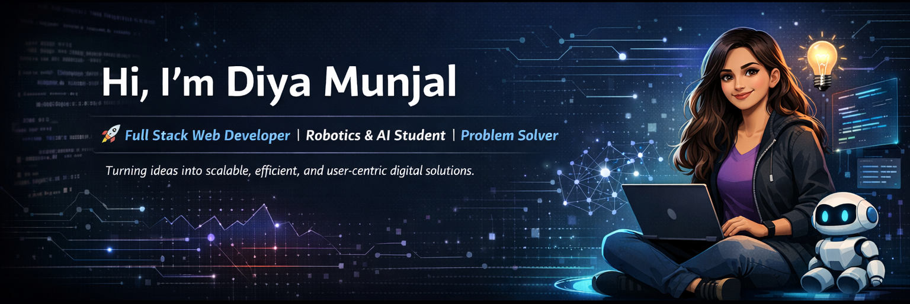

<!-- ================= PROFILE HEADER ================= -->

# 👋 Welcome to My GitHub

  

<!-- ================= ABOUT ================= -->
<h2>✨ About Me</h2>

- 🎓 **B.Tech in Robotics & Artificial Intelligence (2023–2027)**  
  Chandigarh Group of Colleges, Jhanjeri 

- 🔭 **Currently Working On:**  
  🤖 **AI-Based 8-Puzzle Game Solver** *(A*, Dijkstra, Bellman-Ford)*

- 🌱 **Currently Learning:**  
  🧩 Full Stack Web Development + DSA (Python)

- 💡 **Core Strengths:**  
  Analytical Thinking • Clean Code • System Design (Beginner) • Problem Solving

- 📫 **Reach Me At:**  
  📧 <a href="mailto:diya.jind01@gmail.com"><b>diya.jind01@gmail.com</b></a>

<!-- ================= QUICK HIGHLIGHTS ================= -->
<h2>📌 Quick Highlights</h2>

<ul>
  <li>🧠 Strong foundation in Data Structures, Algorithms & Core CS</li>
  <li>💻 Hands-on experience with Full Stack & Algorithm-based projects</li>
  <li>🤖 Practical exposure to AI, ML, Robotics & Embedded Systems</li>
  <li>📊 Active problem solver with 100+ coding challenges solved</li>
  <li>🤝 Strong teamwork, communication & leadership experience</li>
</ul>

<!-- ================= TECH EXPERTISE ================= -->
<h2>🧠 Technical Expertise</h2>

<ul>
  <li><b>🌐 Frontend Development</b> 
      HTML5 • CSS3 • Responsive Web Design • JavaScript (ES6+) • React.js • Tailwind CSS
  </li> 

  <li><b>🧠 Data Structures & Algorithms</b> 
      Arrays • Strings • Linked Lists • Stacks • Queues • Trees • Graphs 
      Searching & Sorting • Recursion • Dynamic Programming 
      Shortest Path Algorithms (Dijkstra, A*, Bellman-Ford) 
      Time & Space Complexity
  </li> 

  <li><b>🤖 AI / ML & Data</b> 
      Machine Learning Basics • ANN Models • Prompt Engineering 
      Data Cleaning • Model Evaluation • Python for Data Analysis
  </li> 

  <li><b>🗄️ Backend & Databases</b> 
      Node.js • Flask • Django • MySQL • MongoDB 
      Authentication & Authorization • Database Design
  </li> 

  <li><b>🧩 Core Computer Science</b> 
      Operating Systems • DBMS • Computer Networks 
      Computer Organization & Architecture • Distributed Systems
  </li> 

  <li><b>🧪 Programming & Embedded</b> 
      Python • Java • JavaScript • C • C++ • Embedded C • Arduino
  </li>
</ul>

<!-- ================= EXPERIENCE ================= -->
<h2>💼 Experience & Community</h2>

<ul>
  <li>
    <b>E-Cell Member – VentureNest (CGC Jhanjeri TBI Association)</b> 
    Jan 2025 – Jun 2025 
    Assisted in organizing entrepreneurship & technical events, handled logistics,
    technical setups, and collaborated with cross-functional teams.
  </li> 

  <li>
    <b>D4 Community – Technical Volunteer</b> 
    Oct 2025 – Present 
    Supported hackathons & tech events, assisted in planning, coordination,
    and on-ground technical execution.
  </li>
</ul>

<!-- ================= PROJECTS ================= -->
<h2>🚀 Featured Projects</h2>

<ul>
  <li>
    <b>🤖 AI-Based 8-Puzzle Game Solver</b> 
    Intelligent solver using heuristic search algorithms like A*, Dijkstra & Bellman-Ford. 
    <i>Status:</i> Coming Soon
  </li> 

  <li>
    <b>🛣️ Short Path – Optimal Route Finder</b> 
    Implemented Dijkstra & Bellman-Ford to compute optimal paths in weighted graphs,
    simulating real-world road networks.
  </li> 

  <li>
    <b>🍷 Wine Quality Prediction (Machine Learning)</b> 
    Built ANN-based model using UCI dataset, evaluated using accuracy,
    precision, recall & F1-score.
  </li> 

  <li>
    <b>🧠 Memory Allocation Simulator (Web App)</b> 
    Full-stack visualization of First-Fit, Best-Fit & Worst-Fit memory allocation algorithms.
  </li> 

  <li>
    <b>⚙️ Arduino-Based Automation & Robotics Projects</b> 
    Voice-controlled car, calculator, sensor-based automation & embedded systems.
  </li>
</ul>

<!-- ================= CERTIFICATIONS ================= -->
<h2>📜 Certifications</h2>

<ul>
  <li>IoT using Arduino – NIELIT Haridwar</li>
  <li>Machine Learning using Python – NIELIT Haridwar</li>
  <li>DSA in C++ – Coding Ninjas</li>
  <li>IT Fundamentals – IBM SkillsBuild</li>
  <li>Professional & Communication Skills – IBM SkillsBuild</li>
</ul>

<!-- ================= WHAT I’M LOOKING FOR ================= -->
<h2>🎯 What I’m Looking For</h2>

<ul>
  <li>💼 Internship / Entry-Level roles in Software or Full Stack Development</li>
  <li>📚 Learning-oriented environments with mentorship</li>
  <li>🤝 Teams solving real-world, product-driven problems</li>
</ul>

<!-- ================= CONNECT ================= -->
<h2>🌍 Connect With Me</h2>

  

  

  

  

  

  

<!-- ================= TOOLS ================= -->
<h2>🛠️ Languages & Tools</h2>

  

  <b style="color:#6C63FF;">✨ “Learning never exhausts the mind — it fuels it.” ✨</b>

